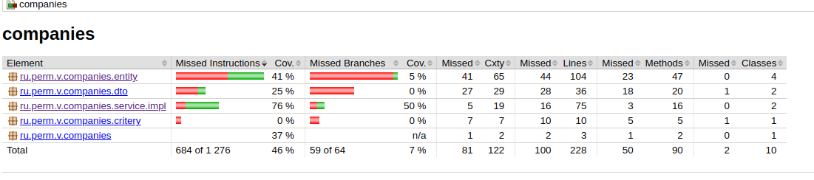
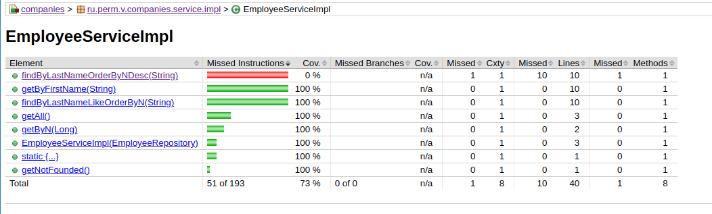

## Типовой проект "Companies" (backend)

Задание:<br/>
1. Создать новый пустой Spring (5) Java-проект Web-приложения с поддержкой Maven, Java 11.  
   Проект должен поддерживать подключение к PostgreSQL (12 и выше) и механизм миграций на базе Liquibase.  
   Необходимые настройки проекта (в том числе и параметры подключения к БД) должны храниться в профиле.
   При запуске проекта должны автоматически формироваться необходимые структуры данных в БД, а так же
   должны сразу же автоматически добавляться сами объекты тестовых данных (не менее 50 организаций, которые описаны в п.3). Должно поддерживаться открытие и запуск проекта в IntelliJ Idea.<br/>
2. В собранном web-приложении должна быть реализована REST-архитектура, предоставляющая доступ без авторизации к следующим web-методам:<br/>
   2.1 Метод получения списка объектов данных (описаны в п.3) в формате JSON с возможностью получения как всего списка данных, так и списка данных, отфильтрованного по переданной в этот метод поисковой строке.<br/>
   2.2 Метод получения одного объекта данных (описан в п.3) в формате JSON по его уникальному идентификатору.<br/>
3. Описание одного объекта данных для использования при реализации п.1, 2:
   Объект данных представляет собой сведения по одной организации, в которые входят:<br/>
   3.1 Полное наименование организации<br/>
   3.2 Краткое наименования организации<br/>
   3.3 ИНН<br/>
   3.4 ОГРН<br/>
   3.5 Почтовый адрес<br/>
   3.6 Юридический адрес<br/>
   3.5 Сведения о генеральном директоре, включая Фамилию, Имя, Отчество, дату рождения<br/>
   3.6 Сведения о филиалах (может быть несколько), включая наименование, почтовый адрес,  
   сведения о руководителе (Фамилия, Имя отчество, дата рождения)<br/>
4. Все классы, методы и свойства должны иметь комментарии в формате Javadoc.
5. Необходимо создать файл с описанием:<br/>
   5.1 Необходимых для запуска web-приложения настроек в профиле<br/>
   5.2 REST API web-приложения<br/>
6. Показать работу с БД разными способами (sql native запросы , qbe-запросы)<br/>
7. flyway database migration<br/>
8. Интеграционно протестировать<br/>
9. Кэши для REST<br/>
10. Docker<br/>
11. log<br/>
12. Профили для dev и prod<br/>

### Установка версии java:<br/>

````shell
$ export JAVA_HOME=/usr/lib/jvm/java-1.11.0-openjdk-amd64
````
Проверка:

````shell
$ ./mvnw -version

Apache Maven 3.6.3 (cecedd343002696d0abb50b32b541b8a6ba2883f)
Maven home: /home/vasi/.m2/wrapper/dists/apache-maven-3.6.3-bin/1iopthnavndlasol9gbrbg6bf2/apache-maven-3.6.3
Java version: 11.0.19, vendor: Ubuntu, runtime: /usr/lib/jvm/java-11-openjdk-amd64
Default locale: ru_RU, platform encoding: UTF-8
OS name: "linux", version: "5.4.0-150-generic", arch: "amd64", family: "unix"

````

### Использование базы данных

Используется программа psql из дистрибутива PostgreSQL.

Создание базы:

````shell
$ psql
# create database companies; 
````
Для подключения к БД используются user/password из переменных операционной системы PG_USER, PG_PASSWORD. По умолчанию значения обеих переменных 'postgres'.

Подключение через psql:

````shell
$ psql --dbname=companies 
````

Для версионирования БД используется [flyway](https://flywaydb.org/). Автообновление БД отключено. В application.yaml установлен флаг: 

````yaml
flyway:
    enabled: false
````

Миграции в src/resources/migration. При изменении структуры вручную выполнить:

````shell
$ ./mvnw flyway:migrate -Dflyway.user=postgres -Dflyway.password=postgres -Dflyway.url=jdbc:postgresql://127.0.0.1:5432/companies
````

### Тестирование

Прогон всех тестов (включая интеграционные):

````shell
$ ./mvnw test

Tests run: 15, Failures: 0, Errors: 0, Skipped: 0
````

Прогон только интеграционных тестов:

````shell
$ ./mvnw test -Dtest=*_IntegrationTest

Tests run: 9, Failures: 0, Errors: 0, Skipped: 0
````

Прогон только unit тестов:
````shell
$ ./mvnw test -Dtest=\!*_IntegrationTest 

Tests run: 6, Failures: 0, Errors: 0, Skipped: 0
````

### Покрытие тестами

Использован [jacoco](https://www.eclemma.org/jacoco/). Генерация отчета:

````shell
$ ./mvnw test
$ ./mvnw jacoco:report
````

Отчет будет в папке target/site/jacoco/index.html



Пример отчета по конкретному классу:



Красным или желтым выделены непротестированные участки кода.

### Запуск проекта

````shell
$ ./mvnw clean spring-boot:run
````

### Логирование

Сделана настройка вывода протоколв работы через logback в папку logs. Настройки в файле resources/logback-spring.xml

### Конфигурации (spring profiles)

Конфигурация для разработки расположена в application-dev.yml, для production версии в application-prod.yml. С какой конфигурацией запускать указано в application.yml

````yaml
spring:
  profiles:
    active: dev
````

Профиль можно указать при запуске:

````shell
$ java -jar target/companies-0.0.1-SNAPSHOT.jar --spring.profiles.active=prod
````

### Примечания:

Для гибкой работы с СУБД используется [http://querydsl.com/](http://querydsl.com/)

### Ссылки

[Optional: Кот Шрёдингера в Java 8](https://habr.com/ru/articles/346782/)
[Integration Tests With Maven(dzone)](https://dzone.com/articles/integration-tests-with-maven)
[example project](https://github.com/gkatzioura/egkatzioura.wordpress.com/tree/master/IntegrationTestMaven/src)
